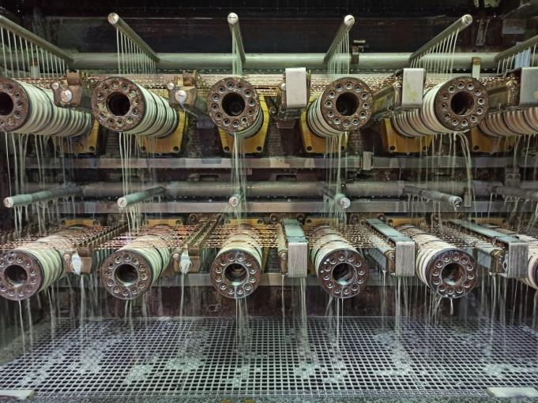

# Emulsion Monitoring System  
**End-to-End Embedded Monitoring & Web Visualization Platform**

## Project Overview

This repository presents a complete **industrial monitoring system** developed during an engineering internship, focused on **automating the monitoring and correction of emulsion parameters** in a copper wire drawing (tréfilage) process.

The project is fully documented in an academic report entitled:
**“Système de surveillance des paramètres d’émulsion pour le tréfilage de cuivre”**  
ENSA Tanger – COFICAB

The system integrates:
- Embedded control (Arduino)
- Wireless communication (ESP8266)
- Backend data storage (PHP + MySQL)
- Web-based visualization and traceability (CSS + JS)

## System Architecture

The solution follows a layered **embedded-to-web architecture**, illustrated below.

## Subsystems Description

### 1. Arduino Firmware

Implements a **Finite State Machine (FSM)** responsible for:
- Periodic data collection from the refractometer
- Decision-making based on concentration thresholds
- Automatic water or oil correction
- Post-correction verification phase

The firmware interfaces with:
- A **refractometer sensor** (4–20 mA converted to ADC)
- A **local LCD display** (SPI)
- **Actuators** (oil pump and water solenoid valve)

It also sends **structured status and measurement messages** over **UART** to an ESP8266 gateway for network transmission.

📁 See `arduino_firmware/README.md`

### 2. ESP8266 Serial-to-HTTP Gateway

Acts as a **communication bridge** between the embedded controller and the backend server.

Main responsibilities:
- Reception of structured messages over **UART** from the Arduino
- Formatting and forwarding data using **HTTP POST** requests
- Ensuring reliable data transmission over a local Wi-Fi network

This gateway enables seamless integration of the embedded system with web-based services while keeping the Arduino firmware network-independent.

📁 See `esp_gateway/README.md`

### 3. Web Application

Provides a **web-based interface** for monitoring, analysis, and traceability of the emulsion control process.

Key features include:
- A dashboard displaying **weekly concentration trends** using Chart.js
- **Concentration history** with filtering by production line and date range
- **Operation history** tracking automatic corrective actions
- Export of historical data to **Excel-compatible format**

The backend is implemented using **PHP** and **MySQL**, and communicates exclusively with the ESP8266 gateway via HTTP.

📁 See `web_application/README.md`